# 🏢 BIJAY_24 Hall Management System


<p align="center">
  <strong>A Full-Stack University Hall Management System</strong>
</p>

<p align="center">
  A collaborative web application designed to digitalize and simplify university residential hall management.
</p>

<p align="center">
  <a href="https://github.com/Hossain-Altaf/BIJAY_24_Hall_Management_System">
    
  </a>
  
  
</p>

The system provides dedicated interfaces for students and hall staff to manage hall admission, student information, room and seat allocation, complaints, notices, and other hall-related services.

> **✅ Project Status:** Completed and tested locally. The project is not currently deployed.

---

## 📑 Table of Contents

* [✨ Key Features](#-key-features)
* [🛠️ Tech Stack](#️-tech-stack)
* [📸 Screenshots](#-screenshots)
* [📁 Project Structure](#-project-structure)
* [⚙️ Local Setup & Installation](#️-local-setup--installation)
* [🔐 Authentication](#-authentication)
* [🗄️ Database](#️-database)
* [🚧 Project Status](#-project-status)
* [👥 Team Contributions](#-team-contributions)
* [🔮 Future Improvements](#-future-improvements)
* [🎯 Project Goals](#-project-goals)
* [👥 Contributors](#-contributors)

---

## ✨ Key Features

The system provides dedicated functionality for students and hall office staff.

### 🎓 Student Portal

* Student registration and login
* Student dashboard
* Digital hall admission application
* View admission application status
* View room and seat allocation
* Find available hall seats
* Dining and meal management
* Laundry service requests
* Sports information
* Submit hall-related complaints
* View complaint information
* View important hall notices

### 🏢 Hall Office / Staff Portal

* Staff authentication
* Staff dashboard
* Manage student information
* Review hall admission applications
* Approve and manage applications
* Manage room and seat allocation
* Find and allocate available seats
* Review and manage student complaints
* Publish and manage hall information
* Monitor hall-related activities

---

## 🛠️ Tech Stack

### Frontend

* HTML5
* CSS3
* Vanilla JavaScript
* Multi-Page Application (MPA)

### Backend

* Node.js
* Express.js
* MongoDB
* Mongoose
* JSON Web Token (JWT)
* Bcrypt

### Tools

* Git & GitHub
* VS Code
* Postman
* MongoDB Atlas

---
## 📸 Screenshots

The following screenshots demonstrate the major features and interfaces of the Hall Management System.

## 📸 Screenshots

The following screenshots demonstrate the major features and interfaces of the Hall Management System.

### 🏠 Homepage

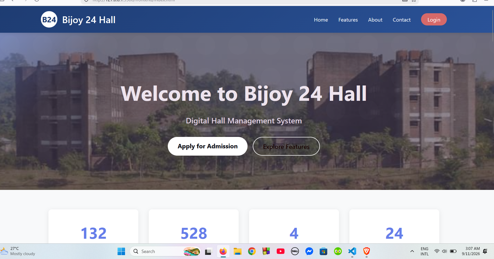

### 🔐 Authentication

#### Login

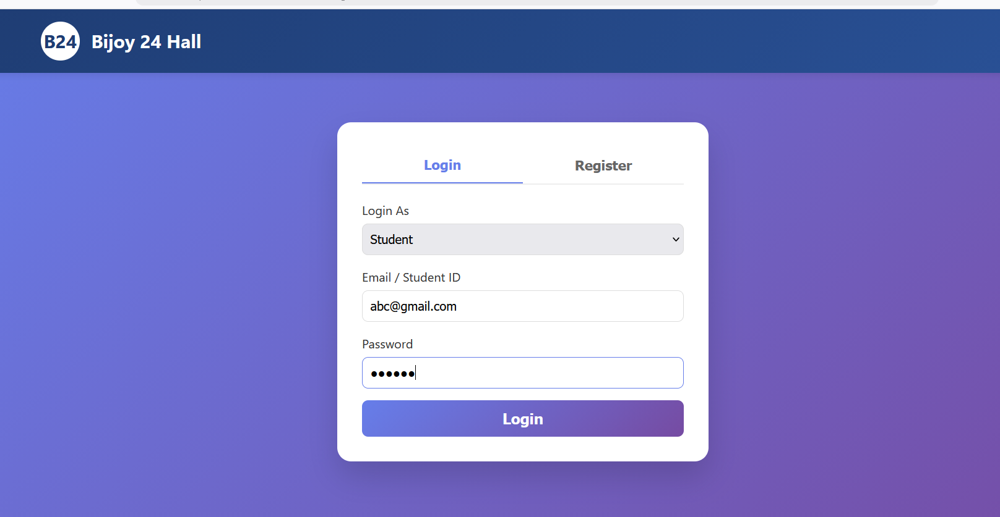

#### Registration

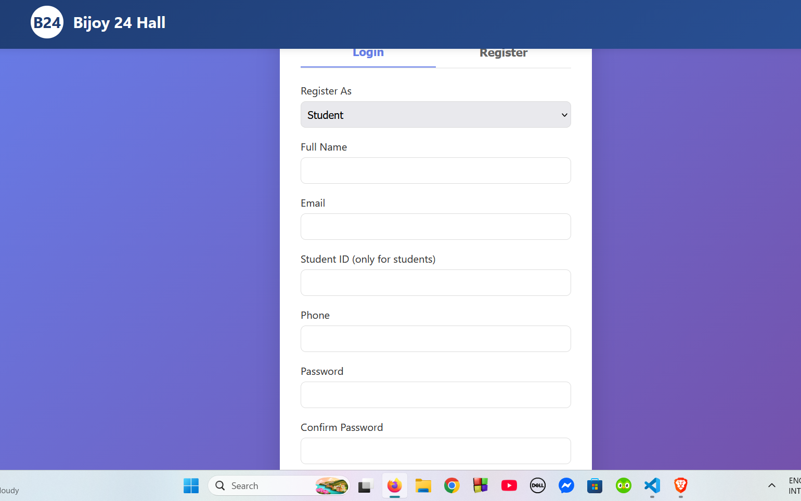

### 🎓 Admission Management

#### Admission Form

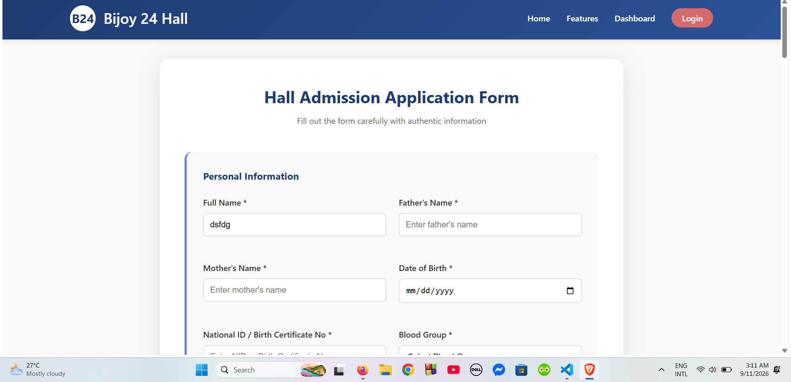

#### Admission Process

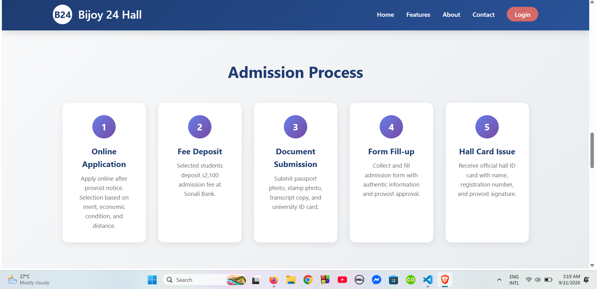

#### Application Management

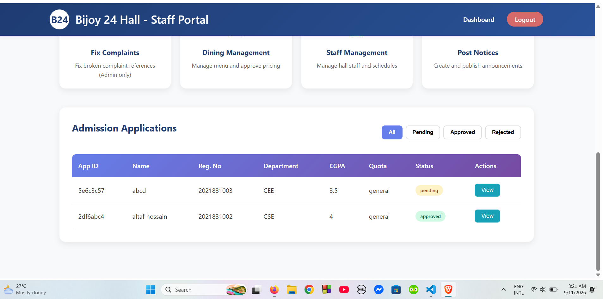

#### Review Application

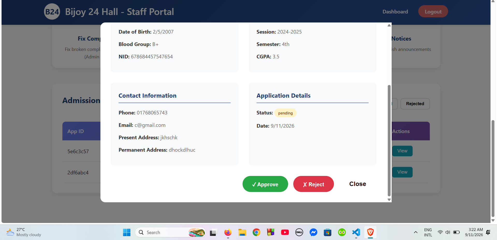

### 🏢 Hall Services

#### Hall Features

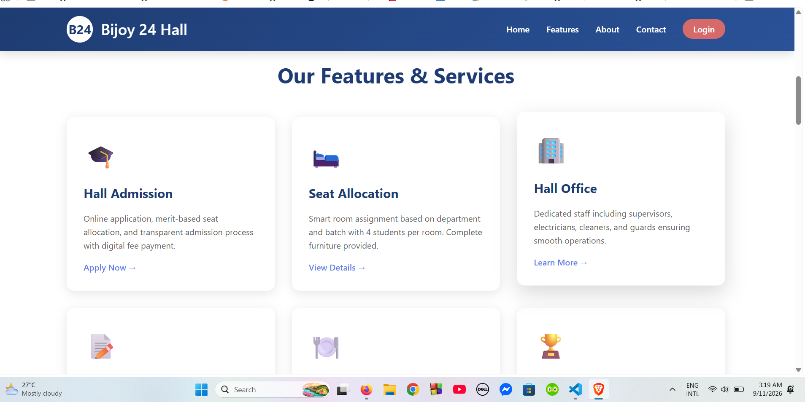

#### Find Hall Seat

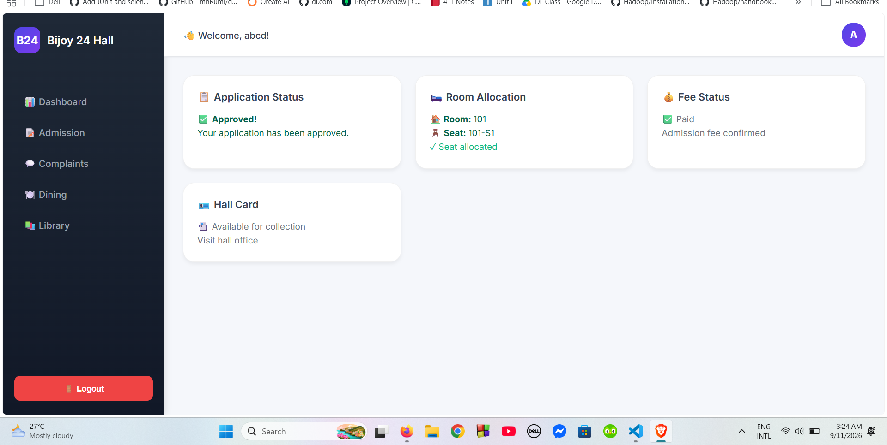

### 🪑 Room & Seat Allocation

#### Seat Allocation

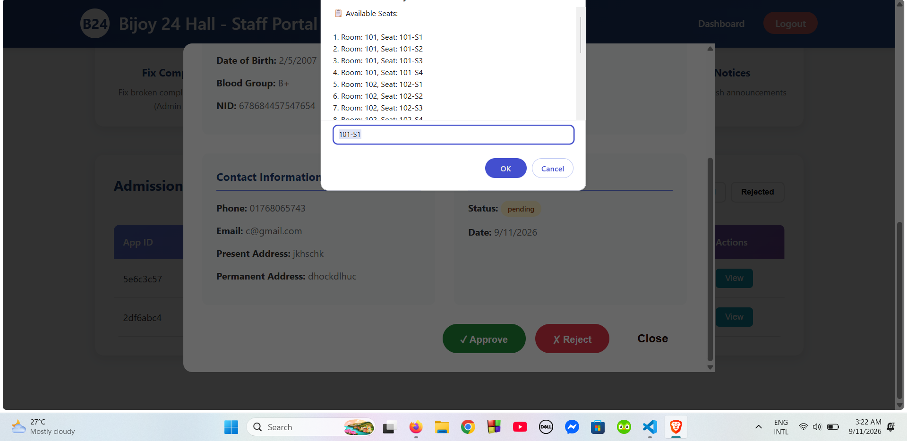

### 📝 Complaint Management

#### Submit Complaint

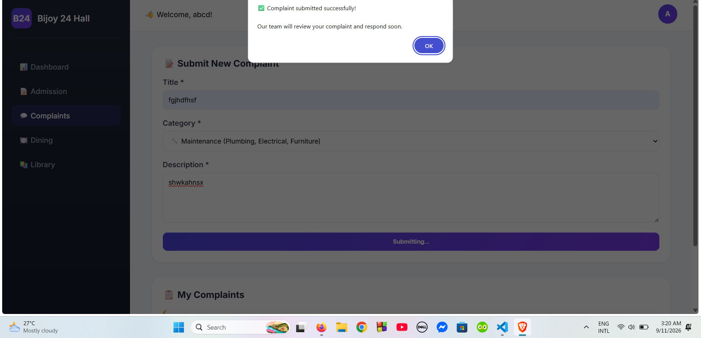

#### Complaint Management

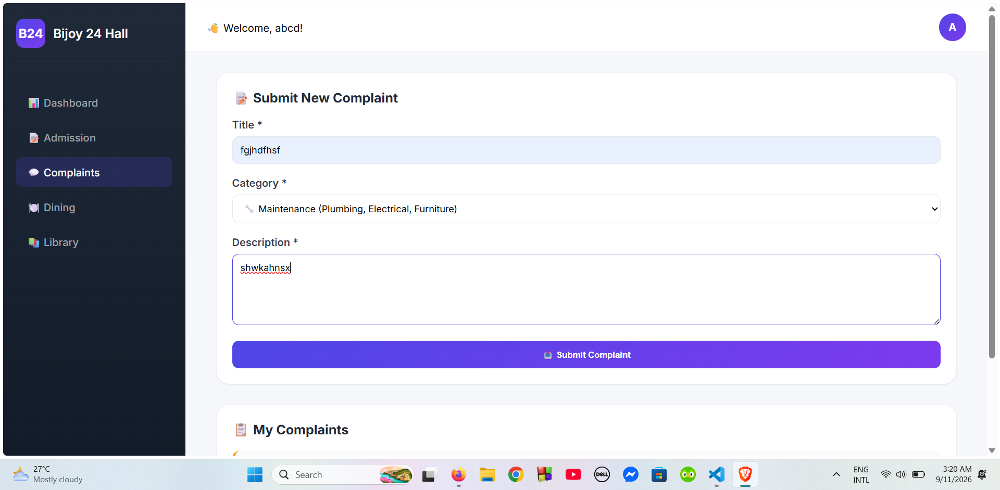

### 📊 Administrative Dashboard

#### Admin Dashboard

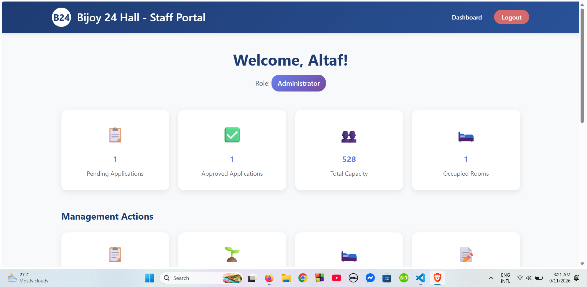

### 📄 Other Forms

#### Submit Form

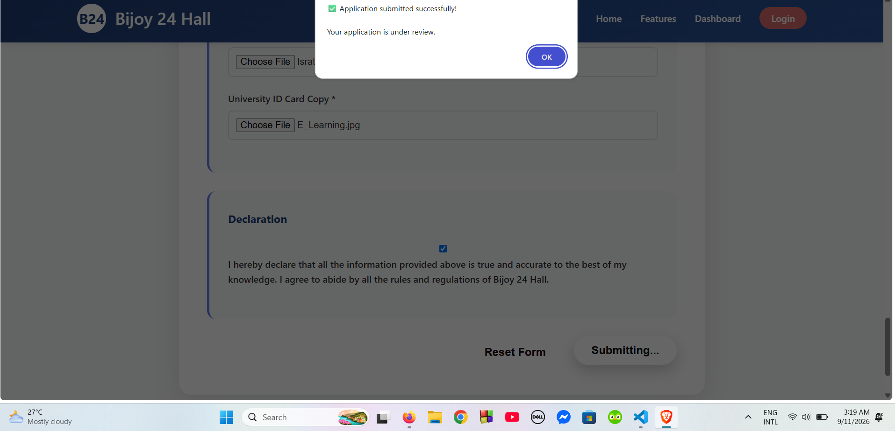
---

## 📁 Project Structure

```text
BIJAY_24_Hall_Management_System/
│
├── backend/
│   ├── config/
│   │   └── ...
│   ├── middleware/
│   │   └── ...
│   ├── models/
│   │   └── ...
│   ├── routes/
│   │   └── ...
│   ├── .env.example
│   ├── api.js
│   ├── package.json
│   ├── seed.js
│   └── server.js
│
├── frontend/
│   ├── imgs/
│   │   ├── admin-dashboard.png
│   │   ├── admission-form.png
│   │   ├── admission-process.png
│   │   ├── application-admin.png
│   │   ├── complain.png
│   │   ├── find-hall-seat.png
│   │   ├── hall-feature.png
│   │   ├── homepage.png
│   │   ├── login.png
│   │   ├── registration.png
│   │   ├── review-application.png
│   │   ├── seat-allocate.png
│   │   ├── submit-complain.png
│   │   └── submit-form.png
│   │
│   ├── admission.html
│   ├── auth.js
│   ├── complaints.html
│   ├── dashboard.html
│   ├── dining.html
│   ├── hall-office.html
│   ├── index.html
│   ├── laundry.html
│   ├── login.html
│   ├── script.js
│   ├── seat_allocation.html
│   ├── sports.html
│   ├── staff-dashboard.html
│   ├── student-dashboard.html
│   └── style.css
│
└── README.md
```

---

## ⚙️ Local Setup & Installation

Follow these steps to run the project locally.

### Prerequisites

Make sure you have the following installed:

* [Node.js](https://nodejs.org/)
* MongoDB or a MongoDB Atlas account
* Git
* VS Code

---

### 1. Clone the Repository

```bash
git clone https://github.com/Hossain-Altaf/BIJAY_24_Hall_Management_System.git
cd BIJAY_24_Hall_Management_System
```

---

### 2. Backend Setup

Navigate to the backend directory:

```bash
cd backend
```

Install the required dependencies:

```bash
npm install
```

Create a `.env` file inside the `backend` directory.

Add your environment variables:

```env
PORT=5000
MONGO_URI=your_mongodb_connection_string
JWT_SECRET=your_secret_key
```

If the project includes seed data, initialize the database using:

```bash
node seed.js
```

Start the backend server:

```bash
node server.js
```

The backend will run locally at:

```text
http://localhost:5000
```

---

### 3. Frontend Setup

Navigate to the `frontend` directory.

You can open the project using the **Live Server** extension in VS Code.

For example:

```text
frontend/index.html
```

Make sure the frontend API URL points to the local backend:

```text
http://localhost:5000
```

The API configuration can be found in the relevant JavaScript files such as:

```text
frontend/script.js
frontend/auth.js
```

---

## 🔐 Authentication

The backend uses:

* **JWT** for authentication
* **Bcrypt** for secure password hashing
* **Role-based authorization** for different types of users

Authentication and authorization ensure that users can access functionality according to their assigned role.

---

## 🗄️ Database

The project uses **MongoDB** as the primary database.

MongoDB is used to store and manage information related to:

* Students
* Users
* Hall information
* Rooms
* Seats
* Admission applications
* Complaints
* Notices
* Dining-related information
* Laundry-related information
* Other hall management data

**Mongoose** is used to define database schemas and interact with MongoDB from the Node.js backend.

---

## 🚧 Project Status

The project is **completed** as an academic collaborative project.

### Current Status

| Component              | Status       |
| ---------------------- | ------------ |
| Frontend               | Completed    |
| Backend                | Completed    |
| Database               | Completed    |
| Authentication         | Completed    |
| API Development        | Completed    |
| Student Portal         | Completed    |
| Hall Office Portal     | Completed    |
| Admission Management   | Completed    |
| Room & Seat Allocation | Completed    |
| Complaint Management   | Completed    |
| Screenshots            | Added        |
| Deployment             | Not Deployed |

The system has been developed and tested in a local development environment.

---

## 👥 Team Contributions

This is a **collaborative academic project** developed by a team of two with separate responsibilities for backend and frontend development.

### 👨‍💻 Israt Jahan Chadni — Backend Developer

Responsible for the **backend development, API implementation, database integration, authentication, and server-side functionality** of the system.

**Contributions:**

* Developed the backend using **Node.js and Express.js**
* Designed and implemented **RESTful APIs**
* Designed MongoDB database schemas and models using **Mongoose**
* Implemented **JWT-based authentication**
* Implemented role-based authorization
* Implemented secure password hashing using **Bcrypt**
* Developed student and user management functionality
* Developed hall admission APIs and functionality
* Implemented room and seat allocation functionality
* Developed complaint management APIs
* Managed database connectivity and backend configuration
* Integrated backend APIs with the frontend
* Tested and debugged APIs using **Postman**

**Primary Technologies:**

`Node.js` `Express.js` `MongoDB` `Mongoose` `JWT` `Bcrypt` `REST API` `Postman`

### 👨‍💻 Hossain Altaf — Frontend Developer

Responsible for the **frontend development, user interface, and client-side functionality** of the system.

**Contributions:**

* Designed and developed the user interface
* Developed frontend pages using **HTML, CSS, and JavaScript**
* Created student and staff dashboards
* Developed admission-related interfaces
* Developed complaint-related interfaces
* Implemented frontend interactions
* Connected frontend pages with backend APIs
* Improved the overall user experience and interface

**Primary Technologies:**

`HTML5` `CSS3` `JavaScript`

---

## 🔮 Future Improvements

The following improvements can be considered for future versions:

* [ ] Deploy the frontend
* [ ] Deploy the backend
* [ ] Add real-time notifications
* [ ] Add email notifications
* [ ] Improve student and staff dashboards
* [ ] Add advanced hall statistics and reports
* [ ] Improve mobile responsiveness
* [ ] Add advanced search and filtering
* [ ] Add automated testing
* [ ] Improve API documentation
* [ ] Improve system security
* [ ] Add additional administrative features

---

## 🎯 Project Goals

The main goals of the Hall Management System are to:

* Reduce manual hall management processes
* Centralize student and hall information
* Simplify hall admission and application management
* Simplify room and seat allocation
* Improve complaint management
* Improve communication between students and hall staff
* Make hall-related services easier to access
* Reduce paperwork and manual record keeping
* Provide a structured digital platform for university hall management

---

## 👥 Contributors

### Israt Jahan Chadni

**Backend Developer**
Shahjalal University of Science & Technology (SUST)

* GitHub: [@ichadni](https://github.com/ichadni)
* LinkedIn: [Israt Chadni](https://www.linkedin.com/in/israt-chadni-016870287/)

### Altaf Hossain

**Frontend Developer**
Shahjalal University of Science & Technology (SUST)

* GitHub: [@Hossain-Altaf](https://github.com/Hossain-Altaf)
* LinkedIn: [Altaf Hossain](https://www.linkedin.com/in/altaf-hossain13)


---

## 📌 Note

This project was developed as part of an **academic collaborative project**.

The system has been completed and tested locally. The project is currently not deployed and is maintained as an academic and portfolio project.